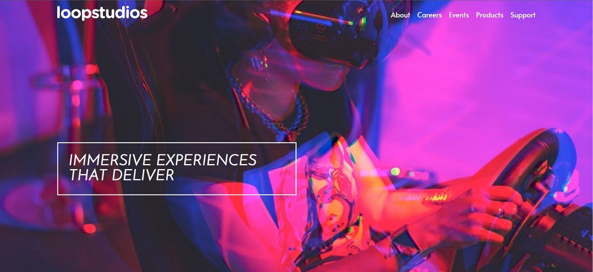

# Frontend Mentor - Loopstudios landing page solution

This is a solution to the [Loopstudios landing page challenge on Frontend Mentor](https://www.frontendmentor.io/challenges/loopstudios-landing-page-N88J5Onjw). Frontend Mentor challenges help you improve your coding skills by building realistic projects.

## Table of contents

- [Overview](#overview)
  - [The challenge](#the-challenge)
  - [Screenshot](#screenshot)
  - [Links](#links)
- [My process](#my-process)
  - [Built with](#built-with)
  - [What I learned](#what-i-learned)
- [Author](#author)

**Note: Delete this note and update the table of contents based on what sections you keep.**

## Overview

### The challenge

Users should be able to:

- View the optimal layout for the site depending on their device's screen size
- See hover states for all interactive elements on the page

### Screenshot



### Links

- Solution URL: [https://github.com/ezivan/loopstudio](https://github.com/ezivan/loopstudio)
- Live Site URL: [https://ezivan.github.io/loopstudio](https://ezivan.github.io/loopstudio)

## My process

### Built with

- Semantic HTML5 markup
- CSS custom properties
- Flexbox
- CSS Grid
- Mobile-first workflow

### What I learned

Something very important and interesting that I learned while doing this challenge is how to use the HTML pictures tag to be able to use an image depending on what kind of device the user is using to view the website.
A very useful and simple way to make responsive.

This is the html code:

```html
<picture>
  <source
    srcset="images/desktop/image-deep-earth.jpg"
    media="(min-width: 768px)"
  />
  
</picture>
```

## Author

- Instagram - [ezivan\_](https://www.instagram.com/ezivan_/)
- Frontend Mentor - [@ezivan](https://www.frontendmentor.io/profile/ezivan)
